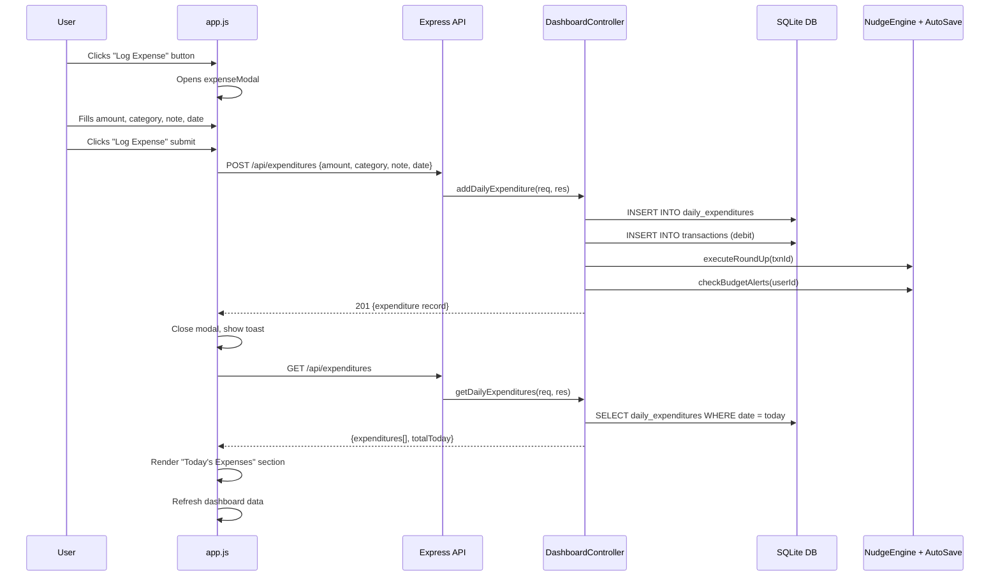

# Implementation Plan: Daily Expenditure Submission Feature

## Objective

Add a user-facing option on the **front page (dashboard)** that allows users to submit their daily expenditure. The user must be able to:

1. **Set the amount** (in RM) of the expenditure.
2. **Select the type/category** of expenditure (e.g., Food, Transport, Shopping, etc.).
3. **Record** the expenditure to the database, where it is persisted and reflected in dashboard analytics.

---

## Project Context

| Aspect | Detail |
|---|---|
| **Project** | GXSave — Behavioural Finance Engine for GXBank |
| **Stack** | Node.js + Express backend, SQLite (via `better-sqlite3`), vanilla HTML/CSS/JS frontend (mobile-first SPA) |
| **Entry Point** | `src/server.js` (Express server on port 3000) |
| **Frontend** | `src/frontend/index.html` + `src/frontend/scripts/app.js` + `src/frontend/styles/main.css` |
| **API Routes** | `src/routes/api.js` → `src/controllers/dashboardController.js` |
| **Database** | SQLite at `gxsave.db`, schema in `src/database/sqlite-schema.js`, connection wrapper in `src/database/connection.js` |
| **Auth** | JWT-based, middleware at `src/middleware/auth.js`, all `/api/*` routes require auth |
| **Existing Transaction API** | `POST /api/transactions` already exists and records transactions with `amount`, `type`, `category`, `merchant`, `description` |

---

## Implementation Steps

### Phase 1: Database — Add `daily_expenditures` Table

> [!IMPORTANT]
> The existing `transactions` table already tracks debit/credit transactions, but a dedicated `daily_expenditures` table provides a cleaner separation for user-submitted daily expense logging vs. system-ingested bank transactions.

**File to modify:** [sqlite-schema.js](file:///d:/antigravity%20ide/utm/src/database/sqlite-schema.js)

**Add the following table definition** at the end of the `SQL_SCHEMA_PG` string (before the closing backtick on line 189):

```sql
-- Daily expenditure submissions
CREATE TABLE IF NOT EXISTS daily_expenditures (
  id TEXT PRIMARY KEY,
  user_id TEXT REFERENCES users(id) ON DELETE CASCADE,
  amount REAL NOT NULL,
  category TEXT NOT NULL,
  note TEXT,
  expenditure_date TEXT NOT NULL DEFAULT (date('now')),
  created_at TEXT DEFAULT (datetime('now'))
);

CREATE INDEX IF NOT EXISTS idx_daily_expenditures_user_date 
  ON daily_expenditures(user_id, expenditure_date DESC);
```

**Then run the migration** to apply the new table:
```bash
npm run migrate
```

**Allowed categories** (use this exact list throughout frontend and backend):

| Category Key | Display Label | Emoji |
|---|---|---|
| `food` | Food & Drinks | 🍔 |
| `transport` | Transport | 🚗 |
| `shopping` | Shopping | 🛍️ |
| `entertainment` | Entertainment | 🎬 |
| `bills` | Bills & Utilities | 💡 |
| `health` | Health | 🏥 |
| `education` | Education | 📚 |
| `groceries` | Groceries | 🛒 |
| `other` | Other | 📌 |

---

### Phase 2: Backend — API Endpoints

**File to modify:** [dashboardController.js](file:///d:/antigravity%20ide/utm/src/controllers/dashboardController.js)

Add **two new methods** inside the `DashboardController` class:

#### 2a. `addDailyExpenditure` (POST handler)

```
Method name: addDailyExpenditure
HTTP: POST
```

**Logic:**
1. Extract `userId` from `req.user.id` (already authenticated via middleware).
2. Read `{ amount, category, note, expenditure_date }` from `req.body`.
3. Validate: `amount` must be > 0; `category` must be one of the allowed values.
4. Generate a UUID for `id` (use the same pattern as other inserts — the schema uses `gen_random_uuid()` which the SQLite wrapper converts).
5. Insert into `daily_expenditures` table using `RETURNING *`.
6. **Also insert into the existing `transactions` table** as a `debit` entry so the spending shows up in dashboard analytics (spending breakdown chart, budget tracking). Use:
   - `type: 'debit'`
   - `gxbank_txn_id: 'EXP-' + Date.now()` (unique identifier)
   - `merchant: 'Manual Entry'`
   - `description: note || 'Daily expenditure'`
   - `transaction_date: expenditure_date || new Date()`
7. After inserting the transaction, trigger existing hooks:
   - `autoSaveEngine.executeRoundUp(txnId)` — so round-up rules apply.
   - `nudgeEngine.checkBudgetAlerts(userId)` — so budget warnings fire.
8. Return `201` with the created expenditure record.

**Follow this existing pattern** from `addTransaction` (line 143–167 of dashboardController.js):
```js
const result = await db.query(
  `INSERT INTO ... VALUES ($1, $2, ...) RETURNING *`,
  [userId, ...]
)
res.status(201).json(result.rows[0])
```

#### 2b. `getDailyExpenditures` (GET handler)

```
Method name: getDailyExpenditures
HTTP: GET
Query params: ?date=YYYY-MM-DD (optional, defaults to today)
```

**Logic:**
1. Extract `userId` from `req.user.id`.
2. Read optional `date` from `req.query` (default to today).
3. Query `daily_expenditures` where `user_id = ?` and `expenditure_date = ?`, ordered by `created_at DESC`.
4. Also return a `totalToday` sum.
5. Return JSON: `{ expenditures: [...], totalToday: number }`.

---

**File to modify:** [api.js](file:///d:/antigravity%20ide/utm/src/routes/api.js)

Add these two routes **after line 14** (after the existing `router.post('/transactions', ...)` line):

```js
router.post('/expenditures', dashboardController.addDailyExpenditure)
router.get('/expenditures', dashboardController.getDailyExpenditures)
```

---

### Phase 3: Frontend — UI Components

#### 3a. Add "Log Expense" Quick Action Button to Dashboard

**File to modify:** [index.html](file:///d:/antigravity%20ide/utm/src/frontend/index.html)

**Location:** Inside the `<section class="quick-actions">` block (lines 149–169), add a new button **as the first item** in the `.action-grid`:

```html
<button class="action-btn action-btn-highlight" onclick="openExpenseModal()" id="logExpenseBtn">
  <span class="action-icon">💸</span>
  <span class="action-label">Log Expense</span>
</button>
```

> [!TIP]
> Make this the first button in the grid and give it a highlighted/accent style (`.action-btn-highlight`) so it visually stands out as the primary action.

#### 3b. Add "Today's Expenses" Section to Dashboard

**Location:** Inside `<div id="dashboardTab">` (line 97), add a **new section** after the streak card (after line 124) and before the gamification section (line 126):

```html
<section class="expenses-section" id="todayExpensesSection">
  <div class="expenses-header">
    <h2 class="section-title">Today's Expenses</h2>
    <span class="expenses-total" id="todayExpenseTotal">RM 0</span>
  </div>
  <div id="todayExpensesList" class="expense-list">
    <p class="empty-state">No expenses logged today</p>
  </div>
</section>
```

#### 3c. Add Expenditure Submission Modal

**Location:** After the existing modals (after line 301, before the closing `</div>` of `mainApp`), add:

```html
<div id="expenseModal" class="modal">
  <div class="modal-content">
    <h2>Log Daily Expense</h2>
    <form id="expenseForm" onsubmit="submitExpense(event)">
      <label>Amount (RM)</label>
      <input type="number" id="expenseAmount" placeholder="0.00" step="0.01" min="0.01" required>

      <label>Category</label>
      <select id="expenseCategory" required>
        <option value="">Select category...</option>
        <option value="food">🍔 Food & Drinks</option>
        <option value="transport">🚗 Transport</option>
        <option value="shopping">🛍️ Shopping</option>
        <option value="entertainment">🎬 Entertainment</option>
        <option value="bills">💡 Bills & Utilities</option>
        <option value="health">🏥 Health</option>
        <option value="education">📚 Education</option>
        <option value="groceries">🛒 Groceries</option>
        <option value="other">📌 Other</option>
      </select>

      <label>Note (optional)</label>
      <input type="text" id="expenseNote" placeholder="e.g. Lunch at Nasi Kandar" maxlength="100">

      <label>Date</label>
      <input type="date" id="expenseDate" required>

      <div class="modal-actions">
        <button type="button" class="btn-secondary" onclick="closeModal('expenseModal')">Cancel</button>
        <button type="submit" class="btn-primary">Log Expense</button>
      </div>
    </form>
  </div>
</div>
```

---

#### 3d. Add JavaScript Logic

**File to modify:** [app.js](file:///d:/antigravity%20ide/utm/src/frontend/scripts/app.js)

Add the following functions:

##### `openExpenseModal()`
- Opens the modal (same pattern as `openNewGoalModal`).
- Pre-fills the date field with today's date (`new Date().toISOString().split('T')[0]`).
- Clears previous form values.

##### `submitExpense(event)`
- Prevents default form submission.
- Reads `amount`, `category`, `note`, `expenditure_date` from the form.
- Calls `api('/expenditures', { method: 'POST', body: JSON.stringify({ amount, category, note, expenditure_date }) })`.
- On success: close modal, show a success toast, refresh dashboard data, refresh today's expenses list.
- On failure: show alert with error message.

##### `loadTodayExpenses()`
- Calls `api('/expenditures')` (no date param = defaults to today).
- Updates `#todayExpenseTotal` with the total.
- Renders each expense in `#todayExpensesList` with: emoji icon, category name, note, amount (RM).
- Use a card/list-item style consistent with `.nudge-item`.

##### Integration with existing flow
- Call `loadTodayExpenses()` at the end of `loadDashboard()` (after line 245).
- Add `getCategoryEmoji(category)` helper function returning the emoji for a given category key.

---

### Phase 4: CSS Styling

**File to modify:** [main.css](file:///d:/antigravity%20ide/utm/src/frontend/styles/main.css)

Add styles at the end of the file:

```css
/* === Daily Expenditure Feature === */

/* Highlighted quick action button */
.action-btn-highlight {
  background: linear-gradient(135deg, var(--primary-dark), var(--primary));
  border-color: var(--primary);
  color: var(--bg);
  animation: glow 2s ease-in-out infinite alternate;
}
.action-btn-highlight:hover {
  transform: translateY(-2px);
  box-shadow: 0 4px 20px rgba(0, 212, 170, 0.3);
}
.action-btn-highlight .action-label { color: var(--bg); font-weight: 600; }

@keyframes glow {
  from { box-shadow: 0 0 5px rgba(0, 212, 170, 0.2); }
  to { box-shadow: 0 0 15px rgba(0, 212, 170, 0.4); }
}

/* Today's Expenses Section */
.expenses-section {
  background: var(--bg-card);
  border-radius: var(--radius);
  padding: 16px;
  margin-bottom: 16px;
  border: 1px solid var(--border);
}

.expenses-header {
  display: flex;
  justify-content: space-between;
  align-items: center;
  margin-bottom: 12px;
}

.expenses-total {
  font-size: 18px;
  font-weight: 700;
  color: var(--danger);
}

.expense-list {
  display: flex;
  flex-direction: column;
  gap: 8px;
}

.expense-item {
  display: flex;
  align-items: center;
  gap: 12px;
  padding: 10px 12px;
  background: var(--bg);
  border-radius: var(--radius-sm);
  transition: background 0.2s;
}

.expense-item:hover { background: var(--bg-card-hover); }

.expense-icon { font-size: 20px; flex-shrink: 0; }

.expense-details { flex: 1; min-width: 0; }
.expense-category { font-size: 13px; font-weight: 600; }
.expense-note { font-size: 11px; color: var(--text-secondary); white-space: nowrap; overflow: hidden; text-overflow: ellipsis; }

.expense-amount {
  font-size: 14px;
  font-weight: 700;
  color: var(--danger);
  white-space: nowrap;
}
```

---

## File Change Summary

| File | Action | What Changes |
|---|---|---|
| `src/database/sqlite-schema.js` | Modify | Add `daily_expenditures` table + index |
| `src/controllers/dashboardController.js` | Modify | Add `addDailyExpenditure()` and `getDailyExpenditures()` methods |
| `src/routes/api.js` | Modify | Add `POST /api/expenditures` and `GET /api/expenditures` routes |
| `src/frontend/index.html` | Modify | Add "Log Expense" button, "Today's Expenses" section, expenditure modal |
| `src/frontend/scripts/app.js` | Modify | Add `openExpenseModal()`, `submitExpense()`, `loadTodayExpenses()`, `getCategoryEmoji()` |
| `src/frontend/styles/main.css` | Modify | Add styles for expense feature (highlight button, expense list, expense items) |

---

## Data Flow Diagram



---

## Key Patterns To Follow

> [!NOTE]
> These patterns are extracted from the existing codebase. Follow them exactly for consistency.

1. **Database queries** use PostgreSQL syntax (`$1`, `$2`) — the `connection.js` wrapper auto-converts to SQLite `?` placeholders.
2. **UUID generation** — use `gen_random_uuid()` in SQL which auto-converts to a SQLite randomblob-based UUID.
3. **RETURNING clause** — use `RETURNING *` on INSERT statements; the wrapper supports this.
4. **API responses** — success: `res.status(201).json(result.rows[0])`, error: `res.status(500).json({ error: error.message })`.
5. **Frontend API calls** — use the existing `api()` helper function with `{ method, body }` options.
6. **Modals** — use `.modal` / `.modal.open` CSS class toggle pattern via `openXxxModal()` / `closeModal('id')`.
7. **Toast notifications** — use the existing `showNudgeToast({ title, message, priority })` function.

---

## Testing Checklist

- [ ] Run `npm run migrate` — new table is created without errors
- [ ] Login via demo mode — dashboard loads normally
- [ ] Click "Log Expense" button → modal opens with today's date pre-filled
- [ ] Submit an expense (e.g. RM 15.50, Food, "Nasi Lemak") → modal closes, toast appears
- [ ] "Today's Expenses" section shows the new entry with correct emoji, category, note, and amount
- [ ] Total at top-right of section updates
- [ ] Spending Breakdown chart on dashboard includes the new expense
- [ ] Budget warnings fire if the expense pushes a category over 80%
- [ ] Submitting with empty amount or no category selected shows validation error
- [ ] Multiple expenses accumulate correctly in the today list and total
